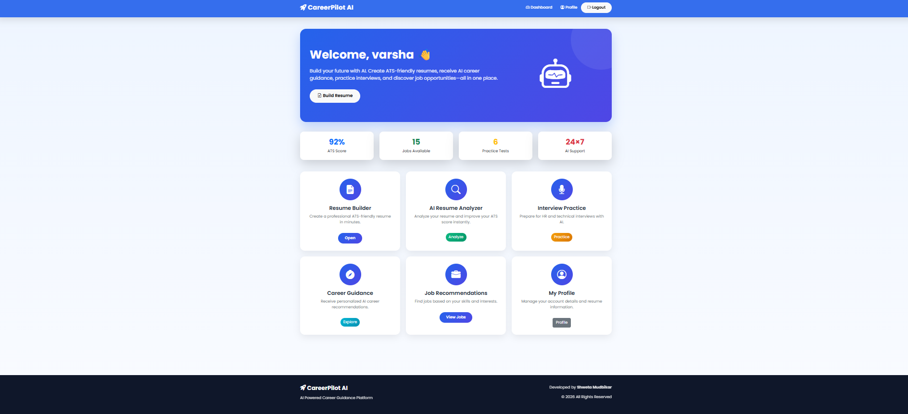
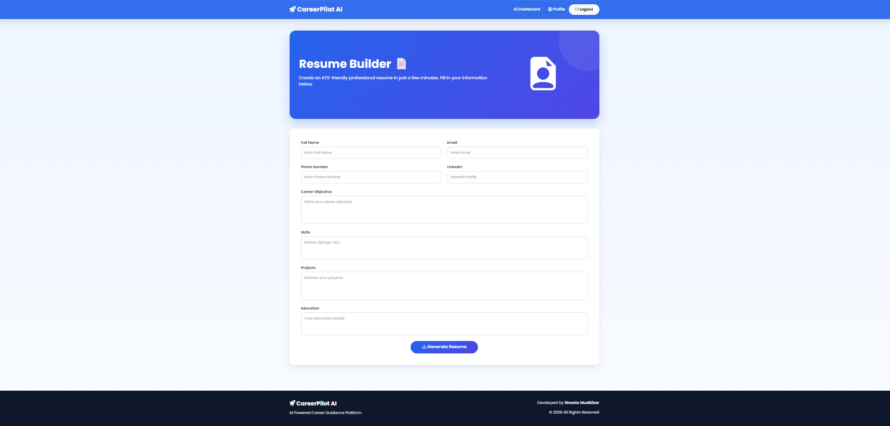
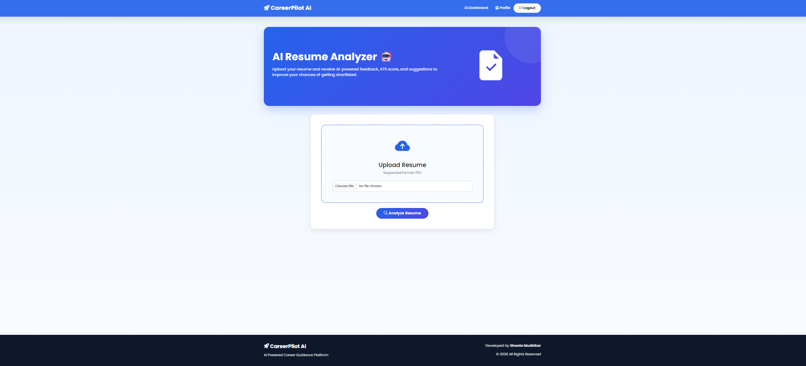
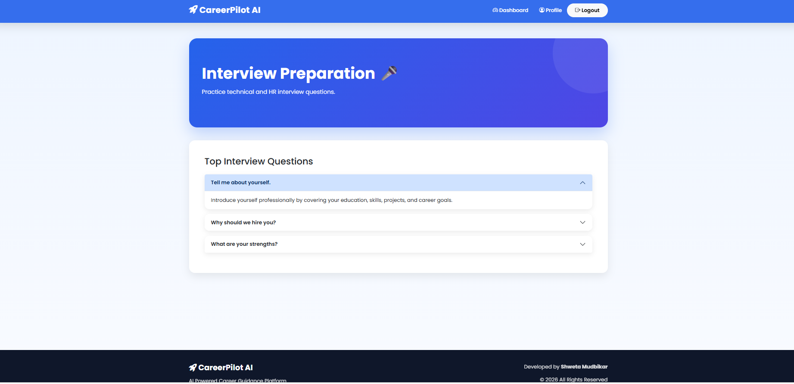
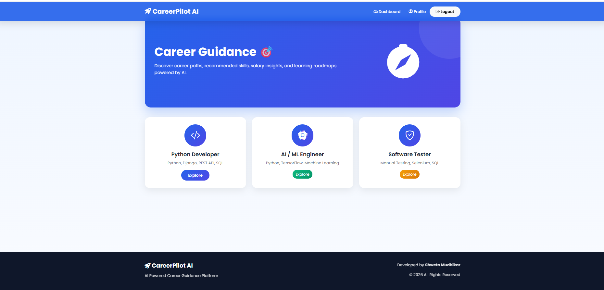
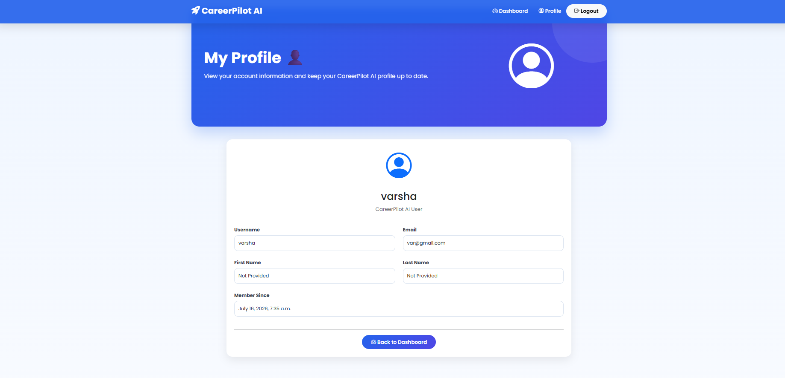

# 🚀 CareerPilot AI

> **An AI-Powered Career Guidance Platform built with Django**

CareerPilot AI helps students and job seekers build professional ATS-friendly resumes, analyze resumes using AI, prepare for interviews, receive career guidance, and discover job opportunities—all from one platform.

---

## ✨ Features

- 📄 ATS-Friendly Resume Builder
- 🤖 AI Resume Analyzer (Gemini AI)
- 🎯 AI Career Guidance
- 🎤 AI Interview Question Generator
- 💼 Job Recommendation System
- 👤 User Registration & Login
- 📥 Resume PDF Download
- 📱 Responsive & Modern UI
- 🔒 Secure Authentication

---

## 🛠️ Tech Stack

| Technology | Used For |
|------------|----------|
| Python | Backend |
| Django | Web Framework |
| HTML5 | Frontend |
| CSS3 | Styling |
| Bootstrap 5 | Responsive UI |
| SQLite | Database |
| Google Gemini AI | AI Features |
| ReportLab | PDF Resume Generation |
| Git & GitHub | Version Control |

---

## 📸 Screenshots

### Dashboard



### Resume Builder



### Resume Analyzer



### Interview Preparation



### Career Guidance



### Profile



---

## 📂 Project Structure

```text
CareerPilotAI/
│
├── backend/
│   ├── accounts/
│   ├── careerpilot/
│   ├── static/
│   ├── templates/
│   ├── manage.py
│
├── screenshots/
├── requirements.txt
├── README.md
└── render.yaml
```

---

## ⚙️ Installation

### 1️⃣ Clone the Repository

```bash
git clone https://github.com/shwetamudbikar2003-lang/CareerPilotAI.git
```

### 2️⃣ Go to Project Folder

```bash
cd CareerPilotAI
```

### 3️⃣ Create Virtual Environment

```bash
python -m venv venv
```

### 4️⃣ Activate Virtual Environment

**Windows**

```bash
venv\Scripts\activate
```

**Linux/Mac**

```bash
source venv/bin/activate
```

### 5️⃣ Install Dependencies

```bash
pip install -r requirements.txt
```

### 6️⃣ Run Migrations

```bash
cd backend
python manage.py migrate
```

### 7️⃣ Start the Server

```bash
python manage.py runserver
```

Open your browser:

```
http://127.0.0.1:8000/
```

---

## 🚀 Future Enhancements

- 📊 Resume ATS Score Dashboard
- 📈 Career Progress Tracking
- 🔔 Job Alerts
- 📹 Mock Interview with AI
- ☁️ Cloud Resume Storage
- 🌐 Deployment on Render

---

## 🤝 Contributing

Contributions are welcome!

1. Fork this repository
2. Create a new branch
3. Commit your changes
4. Push to your branch
5. Open a Pull Request

---

## 👩‍💻 Author

**Shweta Mudbikar**

🎓 Electronics & Communication Engineering

🔗 GitHub: https://github.com/shwetamudbikar2003-lang

---

## ⭐ Support

If you found this project helpful, please give it a **⭐ Star** on GitHub.

It motivates me to build more projects and improve this one.

---

# 🚀 Thank You for Visiting!
